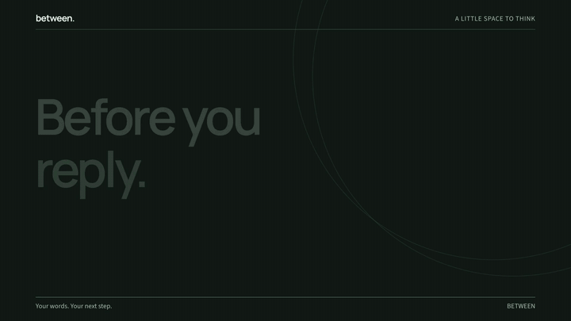
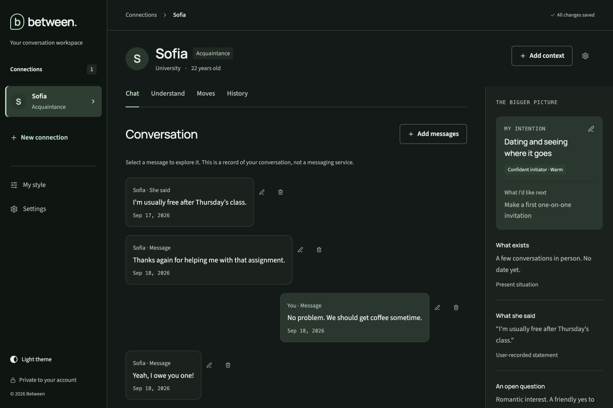
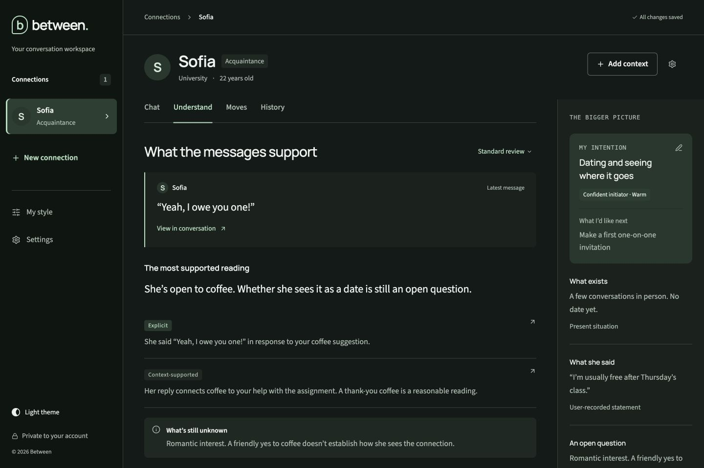
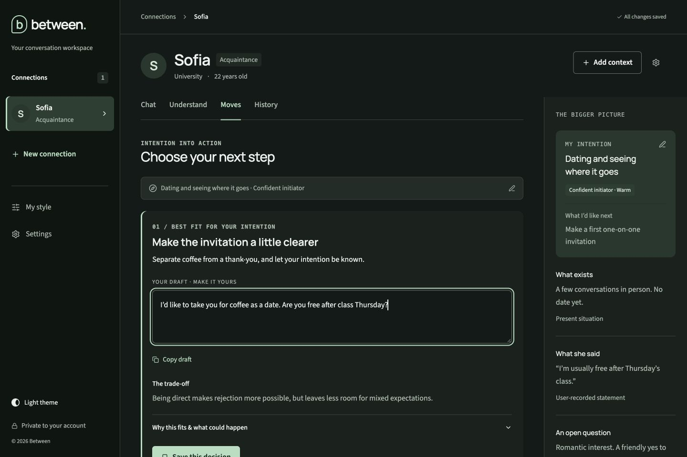
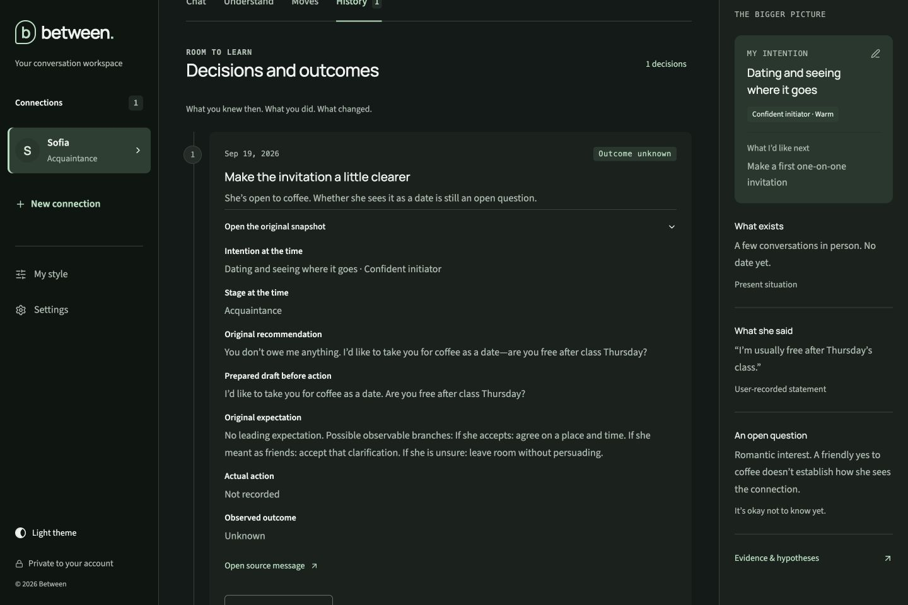
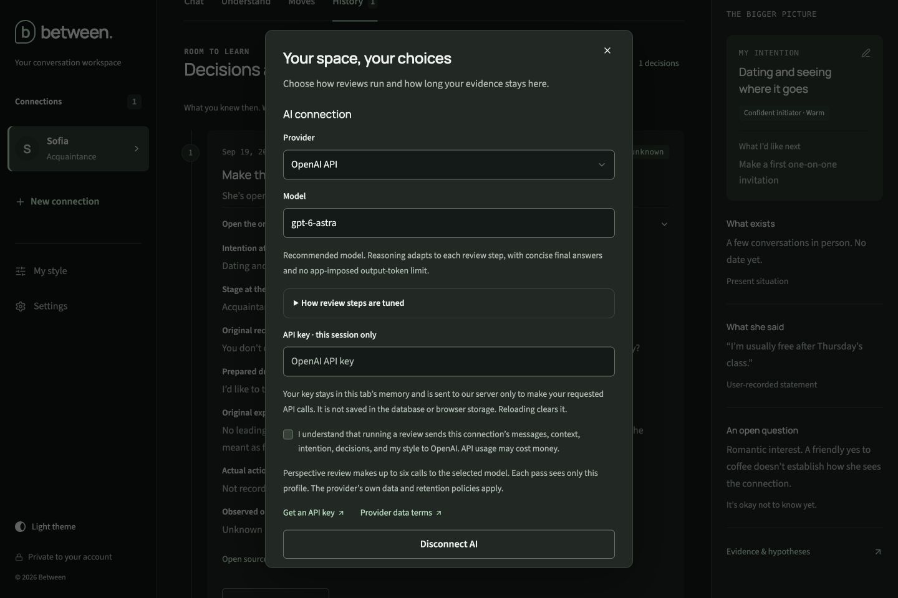
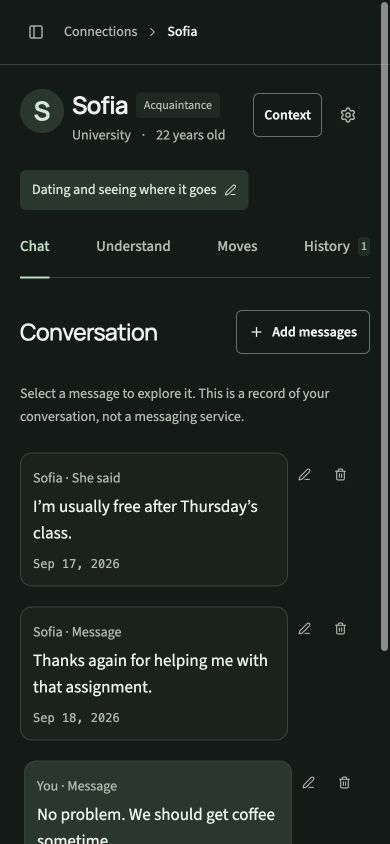
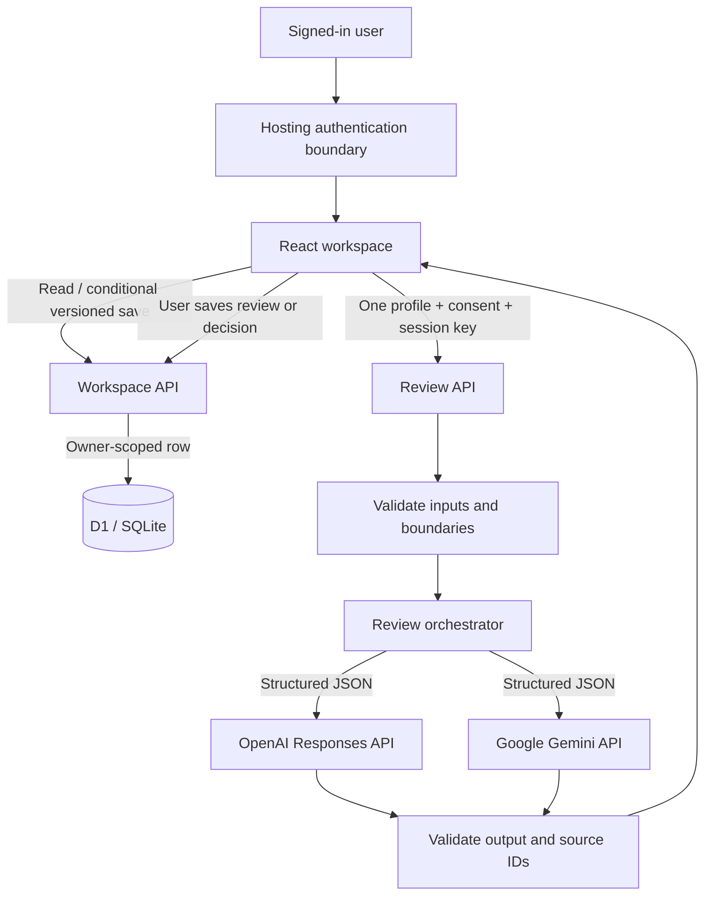

# Between

[](docs/media/between-demo.mp4)

**A place to think before you reply.**

[Open the app](https://between-talking-stage.larel.chatgpt.site/) · [Watch the full video](docs/media/between-demo.mp4) · [Screenshots](#demo)

## What is Between

Between is a private workspace for making sense of an adult talking-stage conversation. Keep the messages, what you want, the next step you chose, and what actually happened in one place.

The workflow is simple: **record the conversation → separate evidence from interpretation → choose a next step → reflect on the outcome.**

- Keep each connection's messages, context, and intention separate.
- Read source-linked claims with explicit uncertainty and alternative explanations.
- Compare different actions, edit a draft in your own voice, and save a decision before acting.
- Record the actual action and outcome without rewriting the original recommendation.
- Control retention, export your workspace, or remove a connection.

Between never sends a message to another person. It does not claim to know their feelings.

## Why I built it

A short reply can carry more uncertainty than information. I wanted a workspace that makes that uncertainty visible and keeps the next step grounded in what was actually said.

The central design rule is that your intention can change the action you choose; it should not become evidence of someone else's intention. Keeping the original decision beside the eventual outcome also makes it easier to learn without rewriting what you thought at the time.

## Demo

The [hosted app](https://between-talking-stage.larel.chatgpt.site/) requires sign-in and starts with an empty workspace. AI reviews require your own OpenAI or Google Gemini API key. The 22-second video is a product walkthrough; the screenshots below show the actual application using **fictional conversations and illustrative review fixtures**, not measured live-model results.

<table>
<tr>
<td width="50%"><br><strong>1. Keep the conversation in context.</strong> Speaker labels and source types stay visible.</td>
<td width="50%"><br><strong>2. Separate evidence from interpretation.</strong> Each claim leads back to its source.</td>
</tr>
<tr>
<td><br><strong>3. Choose and edit a next step.</strong> The draft is yours to change.</td>
<td><br><strong>4. Preserve what you knew then.</strong> Advice, prepared wording, and actual outcomes remain distinct.</td>
</tr>
<tr>
<td><br><strong>5. Control processing and retention.</strong> Provider choice and data handling are visible.</td>
<td align="center"><br><strong>6. Use the same workspace on mobile.</strong> Navigation and context have dedicated drawers.</td>
</tr>
</table>

## Architecture

**React 19 · TypeScript · Vinext/Vite · Cloudflare Workers · D1/SQLite · Zod · OpenAI Responses API · Gemini API**



The browser holds an API key only in memory. A requested review sends it through the server to the chosen provider. Keys are not written to D1 or browser storage. The workspace API stores one JSON document per authenticated owner and checks its version on each update.

A standard review uses one call. Perspective review runs three evidence readers in parallel, followed by strategy, critique, and synthesis. These are separate roles of **one selected model**. Missing passes are disclosed.

```text
app/                 Workspace, forms, themes, and API routes
lib/review-engine.ts Provider adapters and review orchestration
lib/ai-config.ts     Model registry and task-specific settings
lib/validation.ts    Input and output schemas
lib/retention.ts     Evidence expiry and derived-summary cleanup
db/ + drizzle/       D1 schema and versioned migration
tests/               Mocked provider contracts and data lifecycle tests
.github/workflows/   Lint, types, tests, and build on push / pull request
```

## Key engineering decisions

| Decision | Why it exists | Trade-off |
| --- | --- | --- |
| One profile per review packet | Avoid accidental cross-connection context | No analysis across multiple connections |
| Structured outputs plus source-ID validation | Reject malformed results and references to absent evidence | A well-formed claim can still be wrong |
| Goal-free evidence passes | Keep desired outcomes out of the initial interpretation | Extra calls in perspective mode |
| Optimistic concurrency | Refuse a stale write instead of silently replacing another session's work | Conflicts need manual reconciliation |
| Original decision snapshots | Preserve recommendation and prepared draft separately from actual action | Snapshots are application records, not tamper-proof audit logs |
| Session-only API keys | Keep provider credentials out of persisted workspace data | Reloading requires re-entering the key |
| Explicit partial/error states | Avoid treating failed reviewers as agreement | A provider failure can stop the workflow |
| Empty starting workspace | Keep fictional examples out of real users' records | First use requires adding a connection |

The default model IDs are `gpt-6-astra` and `gemini-3.8-flash`; account availability still applies and the model field is editable. [The registry](lib/ai-config.ts) sets reasoning/thinking effort by task: low for reciprocity extraction, medium for standard/conservative reading and synthesis, and high for alternatives, strategy, and critique. OpenAI verbosity is low or medium; Gemini receives equivalent writing instructions.

Requests omit application output-token caps and numeric thinking budgets. A five-minute transport deadline bounds each call. There are no automatic paid retries or silent model substitutions. Unrecognized custom models use provider-default reasoning and must support the structured-output contract.

## Run locally

Use **Node.js 22.13+** and npm. No provider key is needed to run the UI or tests.

```sh
git clone https://github.com/larelgit/between.git
cd between
npm ci
npm run build
npm run db:migrate:local
npm run dev
```

Open **http://localhost:5173** and use the local sign-in flow. It creates a development identity restricted to loopback requests. Local data stays in the ignored `.wrangler/` directory. A new workspace is empty.

For live reviews, open **Settings**, choose a provider/model, enter an API key, and acknowledge the processing scope. Provider usage can incur charges. Reloading clears the key.

```sh
npm run lint       # Zero warnings required
npm run typecheck  # TypeScript checks
npm test           # 26 named tests; mocked transport, no paid API calls
npm run build      # Client and Worker production bundles
npm run check      # All four checks, in CI order
```

CI runs the same checks on pushes to `main` and pull requests, without provider secrets. See [verification details](docs/VERIFICATION.md) and the [technical guide](docs/PROJECT_GUIDE.md).

## Known limitations

- **This is a prototype, not a relationship predictor.** It cannot establish another person's feelings, verify self-reported context, or guarantee an outcome. Prompt rules and output checks do not make model judgment infallible.
- **Live provider behavior is not covered by the tests.** Transport is mocked. Model availability, latency, quality, and billing depend on the provider and account.
- **Hosting is coupled to trusted authentication headers.** The deployed app uses its hosting authentication boundary. Deploying the Worker elsewhere requires a real authentication integration that strips spoofed identity headers. The local mock is for loopback development only.
- **Persistence is intentionally simple.** A workspace is one versioned JSON row. There is no automatic conflict merge, offline sync, or immutable server-side audit trail.
- **Retention is lazy.** Dated evidence expires on the next read/save. Undated evidence remains until removed. Deletion does not remove prior exports, provider records, or platform backups.
- **Conversation entry is manual.** There are no dating-app integrations, screenshot OCR, background imports, or automated sending. Some UI copy currently assumes a female conversation partner.
- **Validation has practical limits.** Adult confirmation is self-attested. Source checks verify that an ID exists, not that an interpretation is correct. Snapshot immutability is a UI convention, not a database guarantee.
- **Further testing is needed.** Automated coverage focuses on provider/data contracts. Full browser automation, multi-user D1 integration, accessibility audits, and live-model evaluations remain future work. Vinext is a beta dependency.

See [media notes](docs/media/README.md) for screenshot provenance, video details, and third-party asset credits.
