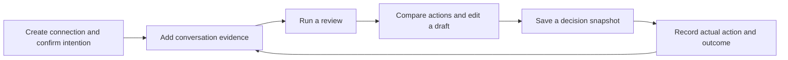
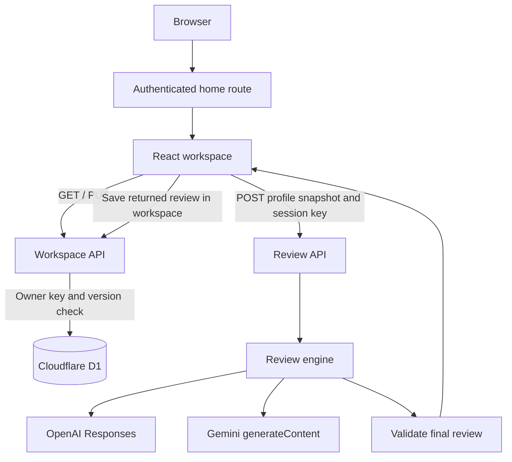
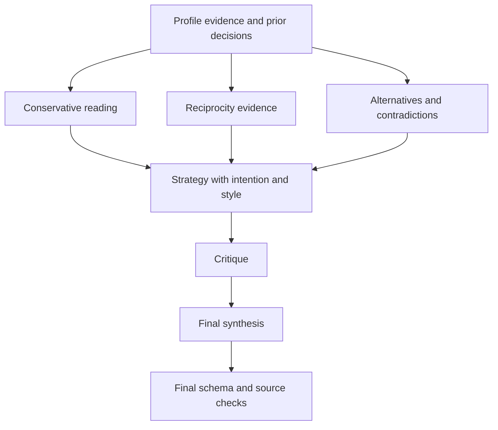

# Between — project status and technical guide

**Snapshot:** September 19, 2026  
**Application baseline:** GitHub showcase release  
**Scope:** the application source, configuration, migration, tests, and local supporting artifacts in this checkout.

Between is a private workspace for recording an adult talking-stage conversation, separating evidence from interpretation, choosing a next step, and recording what actually happened. The core application is implemented and builds successfully. It has persistent per-user storage and two AI provider adapters, but live provider behavior and production deployment were not verified during this documentation review. Lint, type checks, and the 26 named tests pass; CI also builds the production bundles.

This guide describes the code as it exists. “Implemented” means a feature has a code path; it does not by itself mean that the feature has passed browser, production, security, or live-provider testing. Recommendations below are proposed work, not completed features or an agreed delivery schedule.

## Contents

1. [Product purpose and current status](#1-product-purpose-and-current-status)
2. [Work completed](#2-work-completed)
3. [How someone uses the application](#3-how-someone-uses-the-application)
4. [Architecture and repository map](#4-architecture-and-repository-map)
5. [Data model and persistence](#5-data-model-and-persistence)
6. [AI review pipeline](#6-ai-review-pipeline)
7. [HTTP API](#7-http-api)
8. [Privacy, authentication, retention, and deletion](#8-privacy-authentication-retention-and-deletion)
9. [Local development and operations](#9-local-development-and-operations)
10. [Verification and test coverage](#10-verification-and-test-coverage)
11. [Known limitations and recommended next work](#11-known-limitations-and-recommended-next-work)
12. [Maintenance checklist and glossary](#12-maintenance-checklist-and-glossary)

## 1. Product purpose and current status

The product organizes information around one **connection profile** at a time. Each profile has its own conversation, context, intention, review, and decision history. A workspace-level writing style can be reused across profiles.

The central loop is:



The application does not send messages to a conversation partner. Copying a draft, saving a decision, and recording that a message was sent are distinct operations. It does not connect to dating apps or ingest their conversations automatically.

| Area | Current implementation | Qualification |
| --- | --- | --- |
| Connection management | Create, select, archive, restore, export, and delete profiles | Fresh workspaces start empty |
| Onboarding | Adult confirmation, desired connection, role, next objective, pace, and personal boundaries | Adult status is self-attested |
| Conversation records | Paste text, recognize speaker prefixes, label sources, detect duplicates, correct and delete records | Text input only; no file parser or messaging integration |
| Context | Stage, present situation, stated preferences, recollection, and recorded boundaries | Manually maintained by the user |
| AI reviews | Standard review and up to six-pass perspective review | Requires the user's API key and consent; live calls not verified here |
| Evidence presentation | Claims labeled Explicit, Context-supported, Plausible, or Unknown, with source links | Source-ID checks do not establish semantic truth |
| Next actions | Up to three proposed moves, editable drafts, trade-offs, assumptions, branches, and stop conditions | No automatic sending |
| Decision history | Pre-action snapshots, prepared wording, actual action, outcome, and reflection | Snapshots are application records, not an append-only audit log |
| Persistence | D1 row per authenticated owner, conditional versioned writes | Entire workspace saved as one JSON document |
| Data controls | JSON exports, archival, source/profile/decision deletion, 30/90-day retention | No JSON restore/import workflow; retention runs on access |
| Presentation | Dark/light themes, desktop layout, mobile navigation, forms, error and not-found pages | Desktop and mobile screenshots are included |
| Browser tools | List connections, navigate to a connection, open creation form | Only available when `document.modelContext` exists |
| Build and checks | TypeScript, production build, mocked contract tests pass | See verification details for coverage limits |

The hosted app is linked from the README. There is no usage analytics or live-model evaluation report. The npm package is named `between`, is private, and has version `0.1.0`.

## 2. Work completed

The public release packages the implemented workspace, AI provider adapters, dark theme, and empty starting workspace in one initial source snapshot.

The present implementation includes:

- A server-rendered sign-in entry point and authenticated client workspace.
- Intention-first profile creation and editable per-connection context.
- A conversation record with source types, source selection, corrections, and duplicate filtering.
- OpenAI Responses and Gemini generateContent adapters with structured JSON output.
- Standard and perspective orchestration, partial-review reporting, and stale-result handling.
- Draft editing, clipboard copying, decision snapshots, and outcome check-ins.
- D1 persistence, conflict detection, retry/export recovery, and retention cleanup.
- Safe removal of untouched legacy starter profiles using full-record fingerprints.
- Shared visual tokens, locally served fonts, theme persistence, mobile surfaces, and error states.
- Mocked AI/data contract tests and prototype fixtures used only by tests.

### Supporting launch assets

The checkout also contains an untracked `brag-output/` directory with a launch video, poster, share copy, composition source, and delivery notes. Its delivery notes report a 22-second, 1920×1080, 30 fps MP4. These are supporting marketing artifacts, not an application route or production dependency. Their render/quality claims were not rerun for this guide. Because the directory is untracked at this snapshot, a clean Git clone does not necessarily contain it.

## 3. How someone uses the application

### Sign in and create a connection

The home route checks the authenticated request headers. Without an authenticated user it displays a ChatGPT sign-in link. With an authenticated user it renders the workspace, which loads its saved data from `/api/workspace`.

New users receive an empty workspace. Creation is a four-step form:

1. Enter a name or alias, optionally record where the people met, and confirm both are adults.
2. Choose the desired connection, such as serious relationship, casual dating, friendship, unsure, or a custom intention.
3. Choose a role and optionally add a secondary quality, immediate objective, pace, and personal boundaries.
4. Review and confirm the brief.

The confirmed intention gets a version number. Changing that intention later makes earlier advice stale without changing the underlying messages. Current UI wording and the `her` speaker value are gender-specific; a generalized person/pronoun model has not been implemented.

### Record conversation and context

The **Conversation** view accepts a message or multiple nonblank lines. Each line becomes a separate record. Recognized prefixes are `You:`, `Me:`, `Her:`, and the profile alias followed by a colon. Other lines use the selected speaker.

Each import uses one selected date and one selected source type for its records. Dates can be blank and are shown as unknown. The importer does not infer message timestamps or reconstruct multi-line chat formats.

Supported source types are `Message`, `She said`, `My impression`, and `Event`. Duplicate filtering compares the trimmed text and speaker. A matching pair is considered a duplicate if either date is missing or both dates match. Different known dates allow the same wording to be recorded again.

The context form records the current stage, what currently exists, stated preferences, shared context, and one boundary value. All boundary values other than `None stated` block AI review, including `Friendship only`. This is broader than blocking only no-contact situations.

### Understand the evidence

Selecting a message opens the **Understand** view. The selected message is the review focus; the provider still receives all messages in that profile, its context, and a subset of its decision history.

Before a review, the user selects a provider/model, enters a key, and acknowledges processing in Settings. The key and consent remain in tab memory. Clicking Save settings persists the retention setting; it does not validate the API key with a provider. The first review makes the provider connection.

A successful review contains a summary, evidence-labeled claims, uncertainty, a useful context question, disagreements, and possible moves. Source links return the user to the corresponding conversation record. Answering the context question appends the question and answer to profile context and invalidates previous advice.

The UI avoids repeating an identical review when the stored live review has the same evidence revision, intention version, mode, and selected message. It does not currently include provider/model identity in that comparison.

### Choose a move and save a decision

The **Moves** view presents the proposed actions. Each can include a draft, fit, trade-off, assumption, timing, stop condition, and possible observable branches. Drafts can be edited and copied.

Saving a decision copies the current intention, stage, review summary, source references, and proposed move. It separately stores the user's edited wording as `preparedDraft`. The initial actual action is `Not recorded`, and the outcome is `Unknown`.

Unsaved draft edits live in client state and are cleared when switching profiles or reloading. Saving the decision is what persists prepared wording. The original move draft and prepared draft remain separate, so a later check-in can distinguish the suggestion from what was actually used.

### Record what happened

The **History** view opens an outcome form. Actual-action options include sent as written, sent an edited version, did something else, did nothing, and not recorded. Outcome options are Unknown, Still waiting, Actual reply, or Offline event.

Actual replies and offline events can become new message/event evidence. Unknown or waiting outcomes do not create reply evidence. A check-in stores its timestamp and optional reflection. Adding/removing outcome evidence invalidates the profile's review.

This is contextual memory for later requests. The code does not train a model, calculate a calibrated forecast score, or maintain a separate learning service.

## 4. Architecture and repository map



The review endpoint does not write to D1. It returns a review to the browser, which checks whether the request is still relevant and then saves it through the workspace endpoint. A successful model call and a successful database save are therefore separate events.

### Runtime and libraries

The code uses Next-style App Router files and imports, with **Vinext on Vite** providing the configured build/development path and Cloudflare Workers integration. It is not currently operated by the conventional `next dev` / `next build` scripts.

| Concern | Declared dependency or implementation |
| --- | --- |
| UI | React and React DOM `19.2.6` |
| App Router interfaces | Next `16.3.4` |
| Build/runtime adapter | Vinext `1.0.0-beta.5`, Vite `8.0.13` |
| Worker integration | Cloudflare Vite plugin `1.37.1`, Wrangler `4.92.0` |
| Styling | Tailwind CSS `4.2.1`, application CSS, shared UI components |
| Forms and interactive primitives | Radix/shadcn components; custom application forms |
| Runtime validation | Zod `^3.25.76` |
| Database definition/migrations | Drizzle ORM `0.45.2`, Drizzle Kit `0.31.10` |
| Static checking | TypeScript `5.9.3`, ESLint `9.39.4` |

These are repository declarations, not a claim about the latest available releases. The lockfile pins the installation. The dependency/component catalog includes starter utilities that the current product may not use.

### Source ownership

| Path | Responsibility |
| --- | --- |
| `app/page.tsx` | Sign-in screen or authenticated workspace entry point |
| `app/workspace.tsx` | Main client state, saves, navigation, reviews, decisions, settings, exports, and browser tools |
| `app/forms.tsx` | Intention, context, message import/correction, and outcome forms |
| `app/layout.tsx` | Metadata, global styling, and theme provider |
| `app/theme.tsx` | Dark/light appearance and device-local preference |
| `app/globals.css` | Product styles, themes, responsive behavior, and motion preferences |
| `app/error.tsx`, `app/not-found.tsx` | Recovery and missing-page UI |
| `app/chatgpt-auth.ts` | Trusted header parsing and safe sign-in/sign-out paths |
| `app/api/workspace/route.ts` | Authenticated workspace read/save, cleanup, and optimistic concurrency |
| `app/api/review/route.ts` | Authenticated review request validation and orchestration entry point |
| `lib/types.ts`, `lib/validation.ts` | TypeScript model and Zod validation contracts |
| `lib/review-engine.ts` | Provider requests, role passes, output parsing, and final checks |
| `lib/ai-config.ts` | Configured model defaults and task settings |
| `lib/storage.ts` | D1 binding, same-origin helper, and no-store JSON responses |
| `lib/retention.ts` | Access-triggered expiration logic |
| `lib/seed.ts`, `lib/legacy-starters.ts` | Empty initial state and fingerprint-based starter cleanup |
| `db/schema.ts`, `drizzle/` | Workspace table and initial SQL migration |
| `db/index.ts` | Available Drizzle database helper; current API routes use prepared D1 SQL directly |
| `components/ui/`, `hooks/` | Shared component library and mobile helper |
| `public/` | SVG favicon, local fonts, and font licenses |
| `vite.config.ts`, `build/sites-vite-plugin.ts` | Runtime configuration, local mock authentication, and build metadata copying |
| `scripts/` | Installation, execution-profile selection, build, and local tool environment |
| `.openai/hosting.json` | Sites project association and database/storage binding declarations |
| `tests/review.test.ts` and `tests/data.test.ts`, `tests/fixtures/` | Mocked provider/data tests and historical prototype scenarios |

Generated/dependency directories include `node_modules/`, `dist/`, `.next/`, `.vinext/`, `.wrangler/`, and `.sites-runtime/`. They are not the source of truth for application logic. D1's local persisted data is under `.wrangler/state`; deleting that directory can remove local workspace data.

### UI structure and browser tools

The desktop layout combines connection navigation, the active content view, and contextual information. Smaller layouts use mobile navigation and a context sheet. Dark mode is the default; light mode is stored using the `between-appearance` key. Manrope and Source Sans 3 fonts are served from local assets. Metadata requests that crawlers neither index nor follow the app; this is not an access-control mechanism.

When supported by the browser, three WebMCP tools are registered:

| Tool | Behavior |
| --- | --- |
| `list_connections` | Returns profile IDs, aliases, stages, and archival status |
| `open_connection` | Validates a profile ID and tab, then changes navigation |
| `start_connection_creation` | Opens the creation form without saving a profile |

There are no browser tools here for automatically requesting paid reviews, submitting a connection, or deleting data.

## 5. Data model and persistence

### Logical records

| Record | Main fields and purpose |
| --- | --- |
| Workspace | `profiles`, shared `style`, and `retention`; optional `updated` |
| Profile | Alias, context/stage, boundary, adult flag, archive flag, intention, messages, decisions, latest review, and evidence `revision` |
| Intention | Desired `status`, `role`, secondary quality, objective, custom brief, pace, boundaries, confirmation, and `version` |
| Message | ID, `her`/`you` speaker, text, optional date string, and source kind |
| Claim | Evidence label, claim text, and source IDs |
| Move | Proposed action, draft, fit, trade-off, assumption, timing, stop condition, branches, and source IDs |
| Review | Summary, claims, unknowns, question, disagreement, perspectives, moves, mode, origin, timestamps, evidence/intention versions, and selected message ID |
| Decision | Snapshot of goal/stage/reading/move, prepared draft, expectation, actual action/text, outcome, reflection, and check-in metadata |

Only the latest review is stored directly on a profile. Saved decisions preserve selected material from earlier reviews. Reviews have no persisted provider/model identity, token usage, cost, or prompt-version field.

### Physical database

There is one table:

```sql
CREATE TABLE workspaces (
  owner TEXT PRIMARY KEY NOT NULL,
  body TEXT NOT NULL,
  version INTEGER DEFAULT 1 NOT NULL,
  updated TEXT NOT NULL
);
```

`owner` is the authenticated stable user ID. `body` is the complete JSON workspace. SQL `updated` is maintained by the routes; the optional `Workspace.updated` field is not the concurrency mechanism.

This simple storage layout keeps all profile data for one owner together. It also means that two tabs editing different profiles still compete on the same workspace version. There is no row-level profile update, server-side profile search, pagination, or change-merge protocol.

### Read and save lifecycle

1. `GET /api/workspace` obtains the authenticated owner and selects their row.
2. If absent, it inserts the empty workspace with `INSERT OR IGNORE`, then reads it back.
3. Starter cleanup and retention run before the response. If cleanup changes the JSON, the server conditionally saves it and increments the row version.
4. The browser keeps data in React state and the row version in a ref.
5. A mutation immediately updates browser state and sends `{ data, version }` in a PUT.
6. The server validates, cleans, and updates only the row matching both owner and submitted version.
7. Success returns the new version and cleaned workspace. No matching version yields HTTP 409.

The client serializes saves, disables many controls during a save or storage error, and exposes Retry and Export current work after failure. Failed-save input remains in current tab memory. There is no durable offline queue or automatic conflict merge. Reloading after an unsaved failure can lose that memory; exporting first is the recovery path.

### Three different version concepts

| Version | Changes when | Used for |
| --- | --- | --- |
| D1 workspace `version` | Any successful workspace write, including cleanup | Preventing silent cross-session overwrites |
| Profile `revision` | Evidence/context is invalidated | Detecting stale review evidence |
| Intention `version` | User confirms an updated intention | Detecting advice based on an older goal |

A review is stale when its saved evidence revision or intention version differs from the current profile. A shared-style edit forces saved reviews stale by setting their `goalVersion` to `-1`. Client analysis tickets also discard late results after relevant context changes or profile switches; discarding a result does not cancel the provider request or its possible charge.

### Validation limits

The Zod contracts currently permit up to 40 profiles per workspace, 500 messages and 300 decisions per profile, 12 claims and 3 moves per review, 8 perspective entries, 8 branches per move, and 500 IDs in each source-ID array. Common text fields are limited to 15,000 characters; profile names to 70 and IDs to 100.

Workspace PUT is additionally limited to 1,500,000 characters of request text; review POST to 700,000. These checks use JavaScript string length, not an exact network-byte limit, and occur after reading the request body. Structural maxima cannot necessarily all be reached together under the aggregate limit.

Date fields are strings rather than validated timestamps. The schema requires `adult: true` for persisted profiles, but does not independently verify age. Most business rules are a combination of UI logic, schema checks, and review-engine gates.

## 6. AI review pipeline

### Provider configuration and payload

The configured defaults in `lib/ai-config.ts` are `gpt-6-astra` for OpenAI and `gemini-3.8-flash` for Gemini. This guide records those configured values; it does not independently confirm their availability to any account.

The model ID is editable. Exact matches to the defaults receive task-specific tuning. Other IDs use provider-default reasoning with task writing instructions, avoiding an assumption that custom models support the same tuning fields.

The provider payload contains the active profile's current situation, stage, stated preferences, context, boundary, all messages, selected message ID, and selected decision-history fields: date, reading, expectation, actual action/text, outcome, and reflection. Strategy-bearing passes also include the current intention and shared writing style. Other profiles are not included by the engine. Personal details that a user writes into text remain part of that text.

### Standard mode

Standard mode makes one model call containing evidence, history, intention, and style. It asks for a structured decision brief. After parsing, the engine validates the final review, attaches identity/version/timestamp metadata, and returns it.

### Perspective mode



The first three readings run concurrently through `Promise.allSettled`. They omit the explicit current intention and style fields. They still receive previous decision text, which may indirectly reflect earlier goals; the code does not guarantee complete goal-blindness.

Strategy, critique, and synthesis then run sequentially. All passes use the same selected provider and model. These are different role prompts, not independent model providers or a majority vote.

If one or two evidence passes fail, the remaining readings can continue with unavailable reviewers labeled. If all three fail, the review stops. Critique failure is tolerated and labeled partial. Strategy or synthesis failure stops the review. A successful full perspective request uses six calls, with no automatic retries.

### Task presets

| Task | Reasoning/thinking | Visible detail |
| --- | --- | --- |
| Standard | Medium | Low |
| Conservative | Medium | Low |
| Reciprocity | Low | Low |
| Alternatives | High | Medium |
| Strategy | High | Medium |
| Critique | High | Medium |
| Synthesis | Medium | Low |

OpenAI requests go to `/v1/responses`, with `store: false`, strict JSON schema output, and, for the configured default model, `reasoning.effort` and `text.verbosity`. Gemini requests go to `v1beta/models/{model}:generateContent`, with the key in a header, JSON MIME/schema settings, and default-model `thinkingLevel`. Gemini answer length is guided by task instructions.

No application output-token caps, numeric thinking budgets, or sampling overrides are sent. Each call has a five-minute transport timeout. This is not a five-minute deadline for an entire perspective review: several stages are sequential. There is no background job, progress stream, total-cost estimate, or server-side request budget.

### Guardrails and validation boundaries

The system prompt asks the model to treat input as untrusted data, avoid mind-reading and diagnoses, distinguish evidence from possibilities, honor boundaries, and avoid manipulation or unsupported quantitative predictions. These are model instructions, not proof that every output will satisfy them.

The application additionally:

- Requires authentication, affirmative processing consent, an adult profile, and confirmed intention.
- Blocks review whenever the profile boundary is anything other than `None stated`.
- Parses JSON and validates the final content against Zod.
- Rejects final claim/move source IDs absent from that profile's messages.
- Rejects selected numerical attraction/interest predictions using a regular expression.
- Rejects explicitly incomplete/stopped provider responses and empty/unreadable output.
- Converts common provider authentication, access, and rate-limit errors into user-facing messages.

The numerical filter is a limited pattern match. Source validation verifies IDs, not whether a cited message supports a claim. Empty source arrays are allowed. Intermediate perspective/critique responses rely on provider schemas and are not separately Zod-validated or source-checked before synthesis. These are useful targets for further hardening.

## 7. HTTP API

All routes require an authenticated user. The JSON helper adds `Cache-Control: no-store`. Mutating routes reject a present Origin header that differs from the request URL's origin; a missing Origin is accepted.

| Endpoint | Input | Success | Notable failure responses |
| --- | --- | --- | --- |
| `GET /api/workspace` | No body | `{ data, version }` | 401 unauthenticated; 409 cleanup race; 503 load/storage failure |
| `PUT /api/workspace` | `{ data: Workspace, version: integer }` | `{ data, version: previous + 1 }` | 400 invalid schema/version; 401 auth; 403 origin; 409 conflict; 413 too large; 503 save/parse failure |
| `POST /api/review` | Profile, style, selected ID, mode, consent, provider/model/key | `{ review }` | 400 schema/config; 401 auth; 403 origin; 413 too large; 422 recorded boundary; 502 provider/engine/parse failure |

The review body has this shape:

```ts
{
  profile: Profile,
  style: string,
  selectedId: string,
  mode: "standard" | "perspectives",
  consent: true,
  config: {
    provider: "openai" | "gemini",
    model: string,
    key: string
  }
}
```

Model IDs must match `[a-zA-Z0-9._-]{1,100}`. Keys must be 15–500 characters. Key length checks do not verify actual validity. The selected ID has a length limit but is not checked for membership by the route.

The review endpoint operates on the submitted profile snapshot, rather than loading an authoritative profile from D1. Workspace PUT accepts a validated replacement document, rather than enforcing every UI transition on the server. For example, decision snapshots are not protected by an immutable database history. Malformed JSON currently falls through to generic catch handlers rather than consistently returning 400.

## 8. Privacy, authentication, retention, and deletion

### Identity and trust boundary

`getChatGPTUser()` reads the `oai-authenticated-user-id` and `oai-authenticated-user-email` headers, with optional encoded full-name headers. The application does not verify an OAuth token itself. Production isolation depends on the hosting authentication layer setting trusted identity headers and preventing callers from spoofing them. Merely hosting the Worker behind an arbitrary proxy is not equivalent to that integration.

Portable local development enables a loopback-only mock sign-in through the Vite plugin. It strips incoming identity headers, checks both hostname and remote address, and injects a fixed development identity when its local sign-in cookie is present. This is a shared test identity on that local database, not a multi-user identity provider. Managed Linux mode disables this mock.

### Where data lives

| Data | Location and lifetime |
| --- | --- |
| Workspace, profiles, evidence, reviews, decisions, style, retention | D1 row belonging to the authenticated user |
| API key, provider/model choice, processing consent | Current React tab state; reload resets them |
| Unsaved forms and draft edits | Current client memory until saved or discarded |
| Theme preference | Browser storage under `between-appearance` |
| JSON exports | Files downloaded to the user's device |
| Review payloads | Sent through the application server to the selected provider |

The application does not persist API keys to its workspace database or browser storage. The server necessarily handles the key to make the requested provider call. Provider retention, platform logs/backups, and downloaded exports are separate concerns; `store: false` is an OpenAI request setting, not a promise of end-to-end encryption or universal deletion. No application-level encryption layer is implemented around the D1 JSON body.

### Retention

The choices are until deleted, 30 days, or 90 days. Cleanup runs during workspace GET and PUT, using the current time and message/decision dates; there is no timer or scheduled deletion worker.

For a timed policy:

- Dated messages older than the cutoff are removed. Undated messages remain.
- If any message is removed from a profile, all its decisions and current review are cleared, its shared context is emptied, its stated-preference text is replaced, and its evidence revision increases.
- If no messages are removed, decisions are filtered by their own date.
- Profile identity, intention, stage, current situation, and boundary fields remain. Retention is not a complete age-based deletion of all profile text.

Invalid nonempty date strings do not pass the cutoff comparison and can be removed. Archive status does not exempt a profile from cleanup. An unused workspace is not pruned until read or saved again.

### Deletion and corrections

Deleting a profile removes that profile and its nested records from the active workspace. Archiving only changes visibility and can be reversed.

Deleting an individual source clears the current review and shared context, replaces stated-preference text, and scrubs generated/private text from all decision records in that profile. Some decision metadata, such as the intention snapshot, stage, date, and actual-action category, remains. It is a deliberately broad cleanup rather than a dependency graph limited to one cited decision.

Correcting a source retains its ID, increments the evidence revision, clears the current review, and withdraws the old reading/expectation for decisions that cited the corrected source. Historical move snapshots can remain, flagged for review.

Deleting a decision removes that history item; it does not currently remove previously created outcome evidence or automatically invalidate the profile's current review. The application has no dedicated whole-account deletion endpoint, export restore workflow, backup erasure API, or provider-record deletion integration.

## 9. Local development and operations

### First local setup

Use Node **22.13 or newer**. Verification for this snapshot used Node `22.16.0` and npm `10.9.2`. From the repository root:

```sh
npm run install:ci
npm run build
```

Initialize a fresh local D1 database with the existing migration:

```sh
node --import ./scripts/sites-env.mjs ./node_modules/wrangler/bin/wrangler.js d1 execute DB \
  --local \
  --config dist/server/wrangler.json \
  --persist-to .wrangler/state \
  --file drizzle/0000_oval_princess_powerful.sql
```

The SQL creates the table without `IF NOT EXISTS`; do this once for a fresh local database. An already-existing-table error is a reason to inspect local state, not to delete it. The command uses `--local` and does not apply a production migration.

Start development:

```sh
npm run dev
```

The portable script defaults to port 5173. Open [the local application](http://localhost:5173) and use the local sign-in flow. No provider key is needed to create profiles or record evidence. Add a key through Settings when testing AI.

### Commands and profiles

| Command | Purpose |
| --- | --- |
| `npm run install:ci` | Profile-aware dependency installation |
| `npm run dev` | Development server |
| `npm run build` | Build server/client output into `dist/` |
| `npm run start` | Serve built output through local Wrangler, persisting local state |
| `npm run lint` | ESLint across the checkout, excluding configured build directories |
| `npm run typecheck` | Type-check the project |
| `npm test` | Run 26 named tests using mocked provider transport |
| `npm run check` | Run the same lint/type/test/build checks as CI |
| `npm run db:generate` | Generate a SQL migration from the Drizzle schema; does not apply it |

`.sites-runtime/execution-profile.json` selects portable or managed Linux execution. Its absence defaults to portable. Portable installation uses npm CI; managed execution has additional installation/build wrappers, including a bounded build. The development mock sign-in is provided by the Vite development middleware. `npm run start` serves built output directly through Wrangler and does not install that same Vite mock-auth middleware.

The hosting configuration declares D1 binding `DB` and no R2 bucket. The checked-in Vite database ID is a local placeholder; actual hosted bindings are supplied by the hosting system. Build output includes `.openai` metadata and the migration directory. A successful local build establishes neither a production deployment nor an applied remote schema. Publishing and migration operations were not performed for this guide.

### Running the existing contract suite

Run `npm test` for the Node test runner through `tsx`. The suite uses mocked provider transports and blocks unintended network calls. Run `npm run check` to run lint, type checking, tests, and the production build in the same order as CI.

### Troubleshooting

| Symptom | Check or recovery |
| --- | --- |
| Workspace cannot load on a fresh install | Confirm `DB` is bound, build output exists, and the local migration was applied to the same persistence directory |
| Save returns 409 | Export unsaved work, reload the current server state, then reconcile changes manually; retry alone cannot refresh the stale version |
| Save fails or exceeds size limits | Export current work before reloading; investigate storage availability or reduce stored evidence/history |
| Review redirects to Settings | Enter the current session key and acknowledge processing |
| Key worked before reload | Session keys are intentionally cleared on reload |
| Provider rejects key/model | Check account key/access and configured model ID; custom IDs must support the structured-output contract |
| Review is partial | One or more reading passes or the critic failed; unavailable passes are labeled |
| Review does not rerun | Evidence, intention, mode, and selected message may still match the cached review |
| Review is blocked by a boundary | The implementation blocks every value other than `None stated`; do not expect a provider call |
| Production-style local start shows sign-in without working mock flow | Use `npm run dev` for the portable Vite mock-auth workflow |

## 10. Verification and test coverage

The showcase release adds `.github/workflows/ci.yml` and a standard `npm test` command. See [VERIFICATION.md](VERIFICATION.md) for the latest check results and their limits.

The 26 tests cover provider request contracts, task settings, custom models, incomplete output, profile isolation, missing reviewers, source IDs, numerical predictions, intention and boundary gates, retention, safe legacy cleanup, and API errors. Real provider calls are not made.

Browser checks during release preparation exercised draft edits, saved decision snapshots, provider settings, theme hydration, and mobile layout. Full authenticated route/D1 integration and an automated browser suite remain future work.

## 11. Known limitations and recommended next work

The following are grounded in the current code. Priorities are suggested sequencing for further work, not commitments.

### First: establish reliable release checks

1. Add route/D1 integration coverage for owner isolation, initialization, 409 conflicts, retention writes, malformed requests, and persistence failures.
2. Verify both configured providers with controlled live inputs, including structured-output compatibility, authentication errors, partial failure, and practical latency.
3. Verify deployed identity-header trust and database migrations in the actual hosting environment.

### Then: close state and provenance gaps

| Current behavior | Why it matters / proposed improvement |
| --- | --- |
| Review records omit provider/model and prompt version | Persist provenance so old reviews can be identified accurately; the UI currently derives a provider label from current session settings |
| Review reuse ignores provider/model changes | Decide whether changing model/provider should permit a fresh review with unchanged evidence |
| Shared-style changes mark stored reviews stale but do not advance the analysis ticket | An in-flight response based on old style can still pass the evidence/intention checks; include style/request configuration in result validity |
| Decision deletion and some check-in changes do not bump the profile revision | Prior decisions are sent to the model, so history changes can leave an existing review treated as current; define history invalidation consistently |
| Outcome-source reuse is based on speaker and exact text | Add tests around shared evidence, replacement, and date/kind changes; changing an outcome can remove a reused source |
| Source corrections retain historical move drafts | Make withdrawn versus historical wording unmistakable and test correction/deletion behavior end to end |
| Intermediate AI outputs lack local schema/source checks | Validate each role response before it influences strategy or synthesis |
| Date strings and selected source IDs have limited validation | Validate their semantics and define timezone handling explicitly |

### Product and operational extensions

The app currently has no export restore, attachment handling, screenshot/OCR ingestion, messaging-platform import, notification scheduler, multi-user collaboration, background review job, application rate limiter, usage/cost dashboard, or application analytics integration.

Useful follow-on decisions include whether to add validated JSON restore, support gender-neutral language, split custom connection and role text into separate fields, and support a more nuanced boundary policy. The current single `intention.custom` field is shared by both custom intention and custom role inputs.

For maintainability, the roughly 2,100-line workspace component can be separated into state/persistence hooks and feature components. The large application stylesheet contains multiple layers of responsive/theme rules. Refactoring should preserve the data transitions and recovery behavior before adding new functionality.

For larger workspaces, consider whether whole-document D1 writes, request-size limits, and synchronous review requests still fit. Background jobs, normalized records, pagination, and more detailed observability should follow demonstrated needs rather than be described as already present.

## 12. Maintenance checklist and glossary

When changing the product, update this guide's date/baseline and verification table. Keep the following relationships aligned:

- Change `lib/types.ts`, `lib/validation.ts`, and applicable persisted-data handling together.
- Change provider defaults and task presets through `lib/ai-config.ts`, then update the mocked contract expectations.
- Review schema changes against both the provider JSON schemas and Zod output validation.
- Treat modifications to prompts, evidence selection, intention/style, and decision-history payloads as potential review-invalidation changes.
- Test deletion and retention against source text, derived text, and preserved metadata separately.
- Keep prototype fixture records out of fresh production seeds.
- Generate and inspect database migrations explicitly; schema generation and migration application are different operations.
- Record whether checks are mocked, local browser checks, or deployed/live-provider checks.

| Term | Meaning in this project |
| --- | --- |
| Connection/profile | One person's conversation and decision context inside a workspace |
| Evidence/source | A user-recorded message, statement, impression, or event |
| Intention | What the user wants and how they want to act; not evidence of the other person's feelings |
| Review | AI-generated reading and suggested actions tied to a profile/intention version |
| Perspective | A role-specific pass by the same selected model |
| Move | One proposed action, with optional draft and conditions |
| Decision | Saved pre-action context plus later action/outcome fields |
| Stale | A review's recorded versions no longer match relevant current state |
| Archive | Reversible hiding from the active-connections list |
| Retention | Access-triggered expiry of dated evidence/history, with derived-data cleanup |
| Workspace version | Database concurrency token for the whole user's JSON workspace |

The source code remains the authority for exact behavior. The main entry points for future work are `app/workspace.tsx`, the two API routes, `lib/review-engine.ts`, and the validation/storage modules described above.
